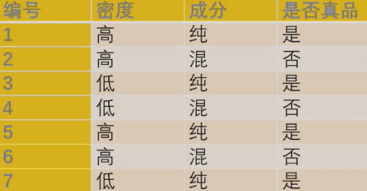
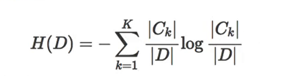
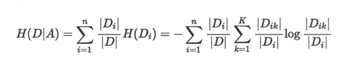
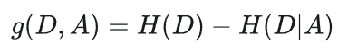
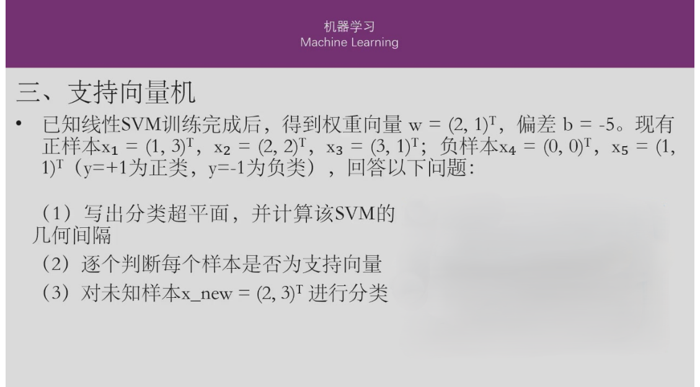
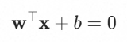
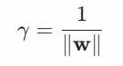
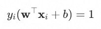
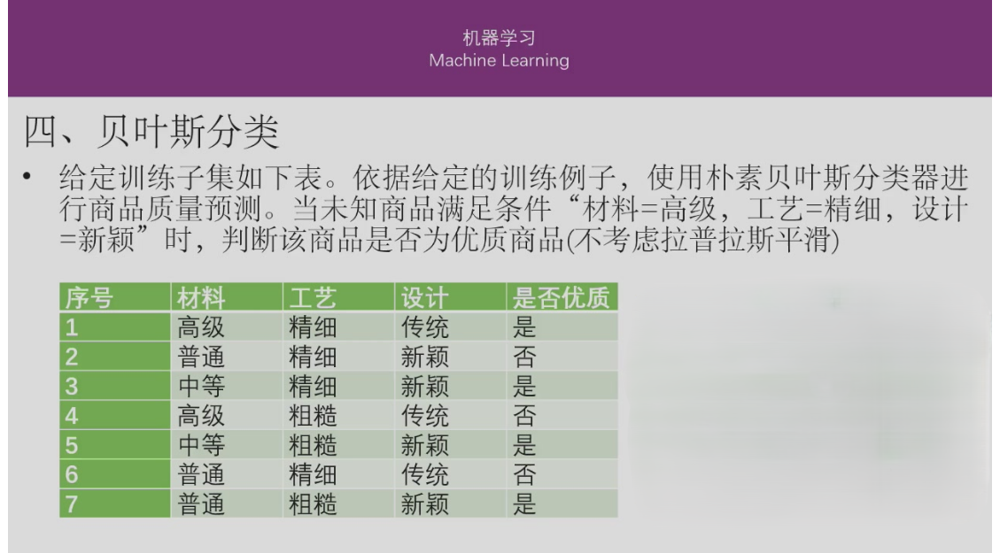

# 机器学习复习
## 机器学习概论
### 真正例(TP)、假正例(FP)、真负例(TN)、假负例(FN)
真正例(TP) = 预测正确的正例

假正例(FP) = 预测错误的次例

真负例(TN) = 预测正确的次例

假负例(FN) = 预测错误的正例
### 混淆矩阵
|         | 预测正例 | 预测次例 |
|---------| --------|---------|
| 实际正例 | TP      | FN      |
| 实际次例 | FP      | TN      |
### 准确率(Accuracy)
Accuracy = (TP + TN) / 总样本
在所有例子中预测正确了多少个？
意义：模型整体预测正确的比例，反映全局性能。
### 查全率(Recall)
Recall = TP / (TP + FN)
在所有正例中找出来了多少个？
意义：模型对正类（合格品）的识别能力，即实际合格品中被正确标记的比例。
### 查准率(Precision)
Precision = TP / (TP + FP)
在预测的正例中对了多少个？
意义：模型预测为合格品的样本中，真实合格品的比例。
### F1分数
F1 = 2 * (Precision * Recall) / (Precision + Recall)
意义：查准率与查全率的调和平均，综合评估模型性能。
## 决策树

### 信息熵公式

D样本总数

Ck第k类样本的数量
### 条件熵公式

对于特征A中的每一类值进行信息熵运算，计算加权平均数。
### 信息增益公式

算出所有特征的信息增益。哪个最大，就选哪个作为根节点。

根据目前特征节点的各个样本的信息熵判断，在信息熵大的子节点进行下一个特征的扩展。
## 支持向量机

### 分类超平面与几何间隔
#### 超平面公式

带入w = (2, 1)，b = -5

得：2 * x1 + x2 - 5 = 0
#### 几何间隔公式

|w| = sqrt(w1 ** 2 + w2 ** 2) = sqrt(5)
### 判断支持向量机
对于标准 SVM，支持向量是满足以下条件的样本

| 样本 |  (w_t * x + b)  |   y_i   |  y_i(w_t * x_i + b)  | 是否支持向量 |
|:---:|:---:|:---:|:---:|:---:|
|  x1=(1,3)  | 2(1)+1(3)-5 = 0    |   +1   | 0   | ❌ 否 |
|  x2=(2,2)  | 2(2)+1(2)-5 = 1    |   +1   | 1   | ✅ 是 |
|  x3=(3,1)  | 2(3)+1(1)-5 = 2    |   +1   | 2   | ❌ 否 |
|  x4=(0,0)  | 2(0)+1(0)-5 = -5   |   -1   | 5   | ❌ 否 |
|  x5=(1,1)  | 2(1)+1(1)-5 = -3   |   -1   | 3   | ❌ 否 |
即只有x2 = (2, 2)是支持向量
### 对新样本进行分类
计算分类超平面，若>0则为正类(y = +1)，若<0则为负类(y = -1)
## 贝叶斯分类

### 计算先验概率P(Y)
P(Y = 是) = 4 / 7

P(Y = 否) = 3 / 7
### 计算条件概率P(Xi|Y)
P(材料=高级∣Y=是)= 1 / 4

P(工艺=精细∣Y=是)= 2 / 4 = 1 / 2

P(设计=新颖∣Y=是)= 3 / 4

P(材料=高级∣Y=否)= 1 / 3

P(工艺=精细∣Y=否)= 2 / 3

P(设计=新颖∣Y=否)= 1 / 3
### 计算后验概率
根据朴素贝叶斯的条件独立性假设，后验概率正比于先验概率与所有条件概率的乘积。
#### 类别为“是”的得分：
P(Y=是)⋅P(x∣Y=是) = P(Y=是)⋅P(高级∣是)⋅P(精细∣是)⋅P(新颖∣是)
#### 类别为“否”的得分：
P(Y=否)⋅P(x∣Y=否) = P(Y=否)⋅P(高级∣否)⋅P(精细∣否)⋅P(新颖∣否)
### 比较与分类决策
P(Y=是∣x) > P(Y=否∣x) -> 分类为 优质商品(是)